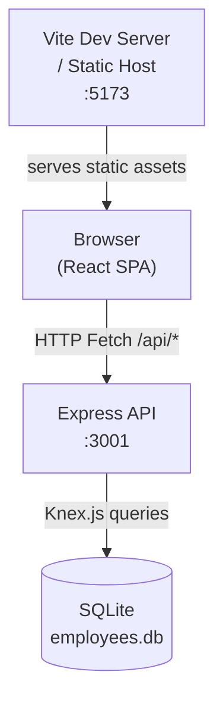
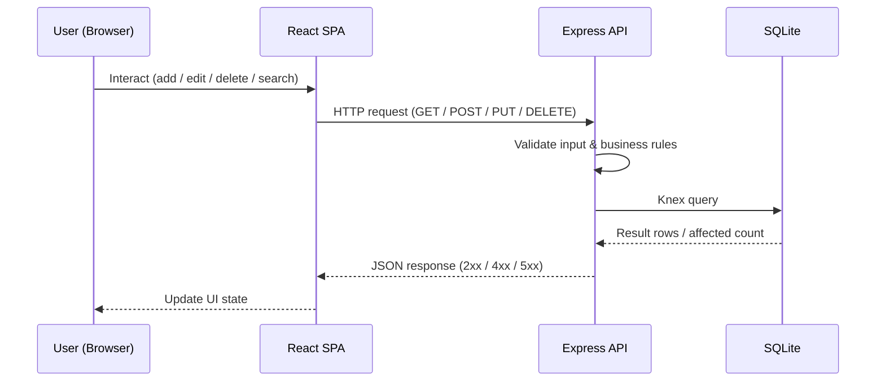
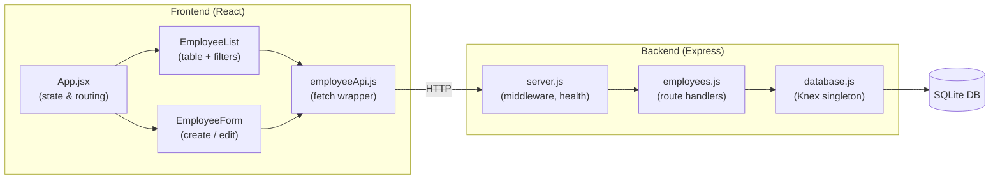
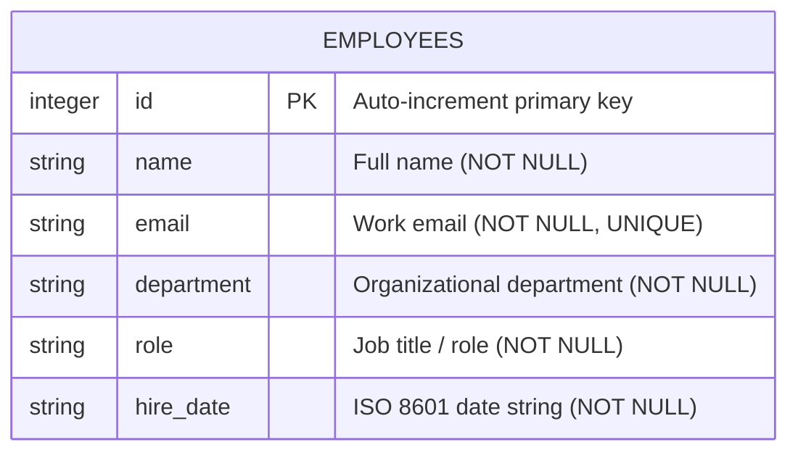
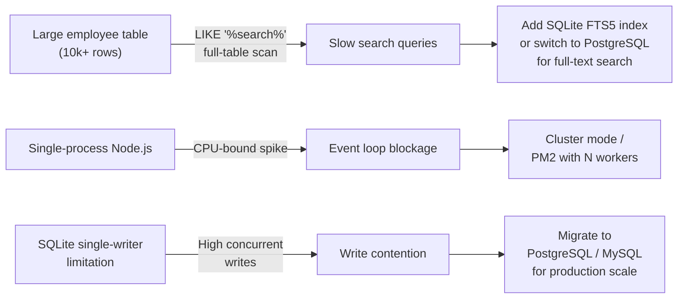
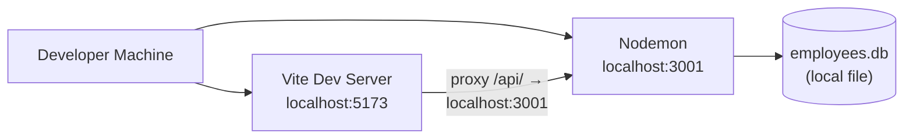
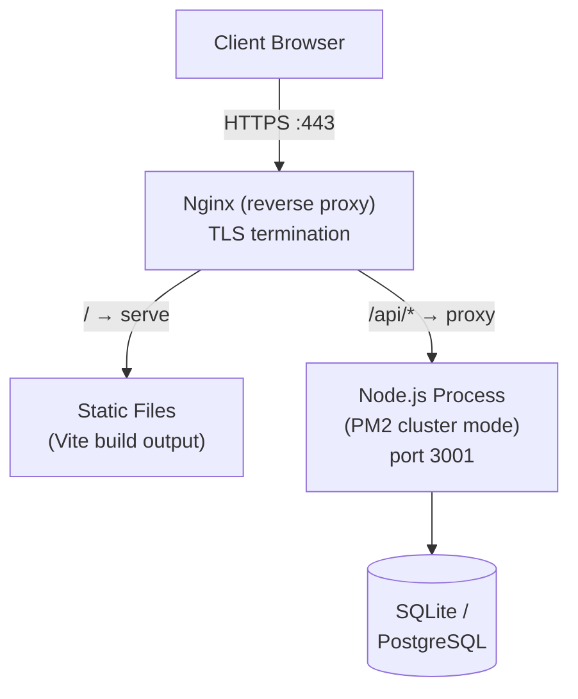
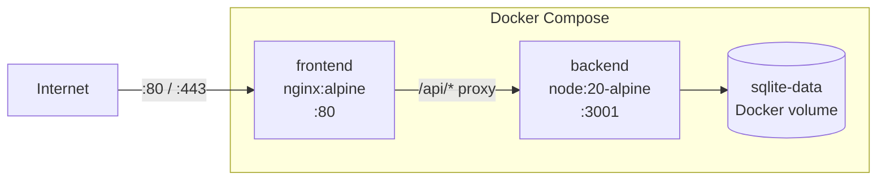

# Technical Design Document: Employee Management Application

## Table of Contents

1. [Problem Statement](#problem-statement)
2. [Proposed Solution](#proposed-solution)
3. [System Architecture](#system-architecture)
4. [Component Breakdown](#component-breakdown)
5. [API Design](#api-design)
6. [Data Models](#data-models)
7. [Security Considerations](#security-considerations)
8. [Performance Requirements](#performance-requirements)
9. [Deployment Strategy](#deployment-strategy)
10. [Trade-offs and Alternatives Considered](#trade-offs-and-alternatives-considered)
11. [Success Metrics](#success-metrics)

---

## Problem Statement

Organizations managing a workforce need a reliable, centralized system to track employee records. Without such a system, HR and engineering teams face:

- **Data fragmentation** – employee records scattered across spreadsheets and siloed tools.
- **No audit trail** – manual edits are difficult to track and verify.
- **Inefficient search and filtering** – finding employees by department or name requires manual effort.
- **Error-prone onboarding/offboarding** – lack of structured workflows leads to missed steps.

The goal of this application is to provide a **lightweight, web-based CRUD interface** that enables authorized users to create, read, update, and delete employee records from a single source of truth.

---

## Proposed Solution

Build a **full-stack web application** composed of:

- A **React single-page application (SPA)** that provides an intuitive UI for managing employee records with real-time search and department filtering.
- A **Node.js/Express REST API** that enforces business rules (validation, duplicate prevention) and exposes employee data over HTTP.
- A **SQLite database** (backed by Knex.js) that stores employee records durably on disk with a well-defined schema.

The separation of frontend and backend into discrete layers allows each to be scaled, replaced, or deployed independently.

---

## System Architecture

### High-Level Architecture



### Request / Response Flow



### Component Interaction



---

## Component Breakdown

### Frontend

| Component | File | Responsibility |
|---|---|---|
| **App** | `src/App.jsx` | Top-level state manager. Controls which view (`list` or `form`) is active, holds the `editingEmployee` reference, and triggers list refresh after mutations. |
| **EmployeeList** | `src/components/EmployeeList.jsx` | Fetches and displays all employees in a sortable table. Provides debounced (200 ms) name/email search and department dropdown filter. Implements a two-step delete confirmation to prevent accidental deletions. |
| **EmployeeForm** | `src/components/EmployeeForm.jsx` | Controlled form for creating and editing an employee record. Delegates submission to a parent-supplied `onSubmit` callback and surfaces API errors inline. |
| **employeeApi** | `src/api/employeeApi.js` | Thin fetch wrapper that maps CRUD operations to REST endpoints, centralises error parsing, and returns plain JavaScript objects. |

### Backend

| Module | File | Responsibility |
|---|---|---|
| **Server** | `src/server.js` | Bootstraps Express, mounts CORS and JSON body-parsing middleware, attaches rate-limiting to `/api/`, registers the employees router, and provides `/health` and global error-handling routes. |
| **Employee Router** | `src/routes/employees.js` | Implements all six REST endpoints for the `employees` resource, including input validation and duplicate-email detection. |
| **Database** | `src/database.js` | Maintains a Knex singleton connected to the SQLite file. Exposes `initializeSchema()` (run once on startup) and `closeDb()` (used in tests). |

---

## API Design

### Base URL

```
/api/employees
```

### Endpoints

| Method | Path | Description | Success | Error codes |
|---|---|---|---|---|
| `GET` | `/api/employees` | List all employees. Supports `?department=` and `?search=` query params. | `200 OK` | `500` |
| `GET` | `/api/employees/departments` | Return distinct department names in alphabetical order. | `200 OK` | `500` |
| `GET` | `/api/employees/:id` | Retrieve a single employee by ID. | `200 OK` | `404`, `500` |
| `POST` | `/api/employees` | Create a new employee. | `201 Created` | `400`, `409`, `500` |
| `PUT` | `/api/employees/:id` | Replace all fields of an existing employee. | `200 OK` | `400`, `404`, `409`, `500` |
| `DELETE` | `/api/employees/:id` | Delete an employee. | `204 No Content` | `404`, `500` |
| `GET` | `/health` | Server health check. | `200 OK` | — |

### Request / Response Examples

**Create employee (`POST /api/employees`)**

Request body:
```json
{
  "name": "Jane Smith",
  "email": "jane.smith@company.com",
  "department": "Engineering",
  "role": "Software Engineer",
  "hire_date": "2024-03-15"
}
```

Success response (`201 Created`):
```json
{
  "id": 42,
  "name": "Jane Smith",
  "email": "jane.smith@company.com",
  "department": "Engineering",
  "role": "Software Engineer",
  "hire_date": "2024-03-15"
}
```

Validation error (`400 Bad Request`):
```json
{ "error": "Missing required fields: name, email, department, role, hire_date" }
```

Duplicate email error (`409 Conflict`):
```json
{ "error": "An employee with this email already exists" }
```

**Rate limit error (`429 Too Many Requests`)**:
```json
{ "error": "Too many requests, please try again later." }
```

### Input Validation Rules

| Field | Rule |
|---|---|
| `name` | Required, non-empty string. Leading/trailing whitespace is trimmed. |
| `email` | Required. Must match `/^[^\s@]+@[^\s@]+\.[^\s@]+$/`. Must be unique across all records. Trimmed. |
| `department` | Required, non-empty string. Trimmed. |
| `role` | Required, non-empty string. Trimmed. |
| `hire_date` | Required, stored as an ISO 8601 date string (`YYYY-MM-DD`). |

---

## Data Models

### Entity Relationship Diagram



### Schema Definition (Knex)

```javascript
table.increments('id').primary();
table.string('name').notNullable();
table.string('email').notNullable().unique();
table.string('department').notNullable();
table.string('role').notNullable();
table.string('hire_date').notNullable();
```

### Notes

- The schema is intentionally minimal. A single `employees` table satisfies all current use-cases without joins.
- `hire_date` is stored as a plain string rather than a `DATE` column to avoid SQLite date-handling quirks and time-zone issues.
- The `UNIQUE` constraint on `email` is enforced at the database level as a second line of defence after the application-level check.

---

## Security Considerations

### Implemented

| Control | Implementation |
|---|---|
| **Rate limiting** | `express-rate-limit` restricts each IP to **100 requests per 15 minutes** on all `/api/` routes. Prevents brute-force and denial-of-service attempts. Standard `RateLimit-*` headers are returned; legacy `X-RateLimit-*` headers are suppressed. |
| **Input validation** | All required fields are checked server-side before any database interaction. The email regex prevents obviously malformed addresses. |
| **Unique email enforcement** | Duplicate emails are rejected both by application logic and a database-level `UNIQUE` constraint. |
| **Error message hygiene** | Generic error messages are returned to the client for unexpected server errors; internal stack traces are only written to server-side logs. |
| **CORS** | `cors()` middleware is configured (currently permissive; see recommendation below). |

### Recommendations for Production

| Risk | Recommendation |
|---|---|
| **CORS is wide-open** | Restrict `cors()` to the exact frontend origin(s) (e.g., `{ origin: 'https://app.example.com' }`). |
| **No authentication / authorization** | Add JWT or session-based auth before any production deployment. All API endpoints are currently unauthenticated. |
| **SQL injection** | Knex parameterised queries already protect against injection; avoid raw query interpolation. |
| **Sensitive data exposure** | Employee PII (name, email) should be treated as sensitive. Add TLS (HTTPS) in production and encrypt the SQLite file at rest. |
| **Rate limit per-user** | Once authentication is in place, consider rate-limiting by authenticated user ID rather than IP to be more accurate. |
| **Secrets management** | `DB_PATH` and `PORT` are sourced from environment variables. Ensure `.env` files are never committed and that secrets are managed via a vault or CI/CD secrets manager. |

---

## Performance Requirements

### Current Targets

| Metric | Target |
|---|---|
| API response time (read) | < 50 ms p95 for up to 10,000 records |
| API response time (write) | < 100 ms p95 |
| Frontend initial load | < 2 s on a standard broadband connection |
| Search debounce | 200 ms — balances responsiveness with reduced API calls |
| Concurrent users | Up to ~50 simultaneous users on a single Node.js process |

### Bottlenecks and Mitigations



### Scalability Notes

- **SQLite** is suitable for single-server deployments with low-to-moderate write throughput (< 100 writes/s). For larger teams or horizontal scaling, migrate to **PostgreSQL**.
- The Knex abstraction layer makes such a migration straightforward — only the `client` configuration and connection string need to change.
- Static frontend assets can be served via a CDN to reduce load on the application server.

---

## Deployment Strategy

### Development Environment



Steps:
```bash
# Terminal 1 – backend
cd backend && npm install && npm run dev

# Terminal 2 – frontend
cd frontend && npm install && npm run dev
```

### Production Deployment (Single Server)



#### Steps

1. **Build the frontend:**
   ```bash
   cd frontend && npm run build
   # Output: frontend/dist/
   ```

2. **Configure Nginx** to serve `frontend/dist` for `/` and proxy `/api/` to `http://localhost:3001`.

3. **Run the backend with PM2:**
   ```bash
   npm install -g pm2
   cd backend && pm2 start src/server.js --name employee-api -i max
   pm2 save && pm2 startup
   ```

4. **Environment variables** (set in PM2 ecosystem config or OS environment):
   ```
   PORT=3001
   DB_PATH=/var/data/employees.db
   NODE_ENV=production
   ```

5. **TLS:** Provision a certificate via Let's Encrypt (`certbot`) and configure Nginx to redirect HTTP → HTTPS.

### Container-Based Deployment (Docker Compose)



```yaml
# docker-compose.yml (illustrative)
services:
  backend:
    build: ./backend
    environment:
      - PORT=3001
      - DB_PATH=/data/employees.db
    volumes:
      - sqlite-data:/data

  frontend:
    build: ./frontend
    ports:
      - "80:80"
    depends_on:
      - backend

volumes:
  sqlite-data:
```

---

## Trade-offs and Alternatives Considered

### Database: SQLite vs. PostgreSQL

| Factor | SQLite (chosen) | PostgreSQL |
|---|---|---|
| Setup complexity | Zero — file-based, no server process | Requires a running server process |
| Horizontal scaling | Single-writer; not suitable for multi-node | Full concurrent read/write, replication support |
| Full-text search | Limited (FTS5 extension required) | Native `tsvector` full-text search |
| Operational overhead | None | Backups, vacuuming, user management |
| Suitable when | Prototype / single-server / < 100k rows | Production / multi-tenant / high concurrency |

**Decision:** SQLite chosen for simplicity and zero operational overhead at this stage. The Knex abstraction makes a future migration to PostgreSQL low-risk.

### Frontend Framework: React vs. Vue vs. Svelte

| Factor | React (chosen) | Vue | Svelte |
|---|---|---|---|
| Ecosystem maturity | Very large; wide library support | Large | Smaller but growing |
| Team familiarity | Assumed high | Medium | Lower |
| Bundle size (base) | ~45 kB (react + react-dom) | ~35 kB | ~5 kB |
| Component model | JSX + hooks | SFC + Composition API | Compiled components |

**Decision:** React selected for its ecosystem maturity and assumed team familiarity.

### Build Tool: Vite vs. Create React App (CRA)

| Factor | Vite (chosen) | CRA |
|---|---|---|
| Dev server startup | < 300 ms (ESM native) | 5–30 s (Webpack) |
| HMR speed | Near-instant | Seconds |
| Maintenance status | Active | Deprecated |

**Decision:** Vite is the modern default; CRA is deprecated.

### State Management: Local State vs. Redux / Zustand

At current scale (one data entity, two views), component-level `useState` and prop passing are sufficient. Redux or Zustand would introduce unnecessary boilerplate. This decision should be revisited if the application grows to 5+ data entities or requires cross-cutting UI state.

---

## Success Metrics

### Functional

- [ ] All five employee fields (name, email, department, role, hire_date) can be created, read, updated, and deleted via the UI.
- [ ] Duplicate email addresses are rejected with a clear error message.
- [ ] Search by name or email returns correct results within 200 ms of the user stopping typing.
- [ ] Department filter correctly narrows the employee list.
- [ ] Delete requires a two-step confirmation before the record is removed.

### Quality

- [ ] Backend test suite passes with ≥ 90% code coverage.
- [ ] Frontend passes ESLint with zero errors.
- [ ] API response times remain under 50 ms p95 for a dataset of up to 10,000 records.

### Operational

- [ ] The application starts successfully with `npm run dev` (backend) and `npm run dev` (frontend) in under 30 seconds.
- [ ] `/health` endpoint returns `{ "status": "ok" }` and `200 OK`.
- [ ] Rate limiting prevents more than 100 API requests per 15 minutes per IP.

### Security

- [ ] No SQL injection vectors in any query path (enforced via Knex parameterisation).
- [ ] API returns `429 Too Many Requests` when the rate limit is exceeded.
- [ ] Internal error details are not exposed in API responses to the client.
